# Screenshots

All screenshots below are **captured from the real running product** via
`node scripts/capture-screenshots.mjs` (shots 01–10) plus the same production
server + real-Chrome discipline for shots 11–12. The capture refuses to write a
file whose rendered `dir` does not match the requested locale — so a blank or
wrong-direction page cannot be passed off as evidence. Nothing here is a
mockup, and no AI output is presented as live provider output.

Capture environment: `NODE_ENV=production`, compiled client, seeded database
(only the documented demo accounts/submission — no secrets or private data),
browser = the installed Chrome via `playwright-core`.

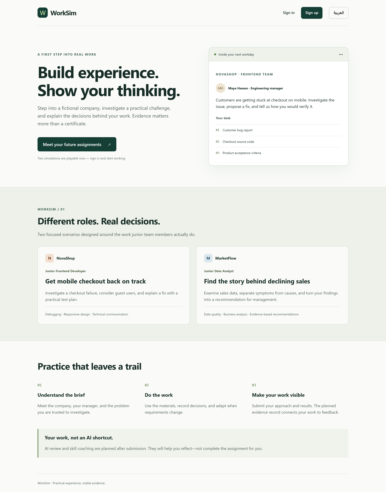
Visitors use the home screen to understand realistic job practice and the evidence model.

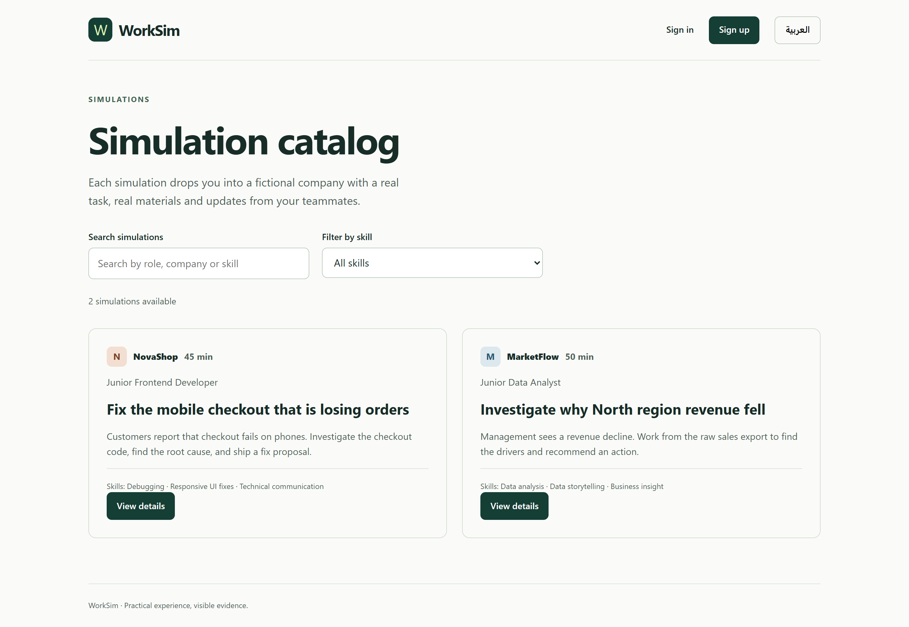
Learners use the catalog to compare both simulations and filter by skill.

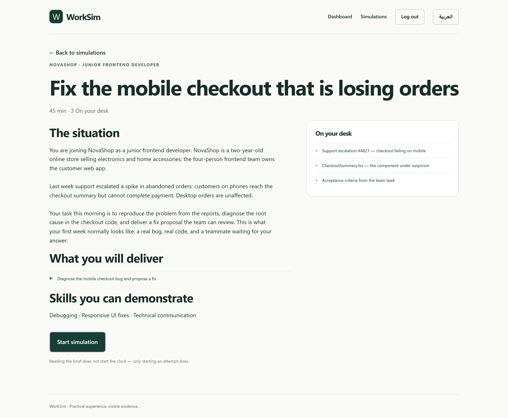
Learners use the NovaShop brief to read the frontend role, requirements and materials before starting.

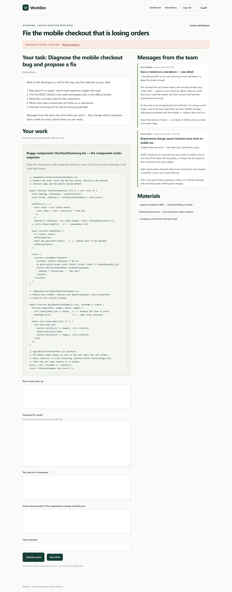
Learners use the NovaShop workspace to inspect the buggy component source, answer task fields and read the team inbox.

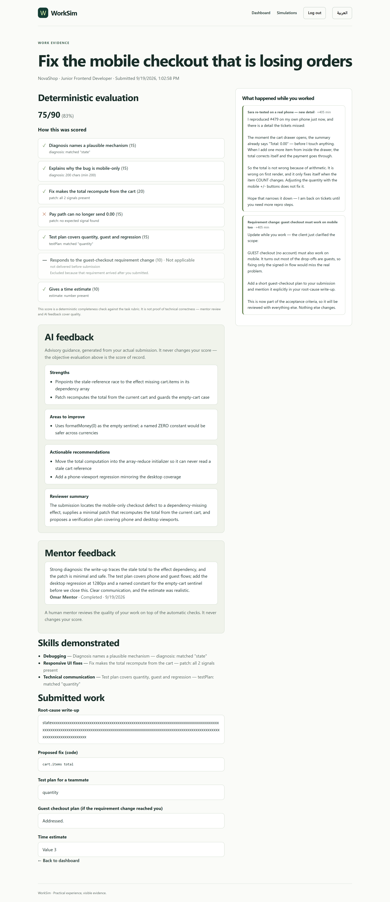
Learners use the evidence page to see the deterministic evaluation plus the AI review section (rendered from stored state).

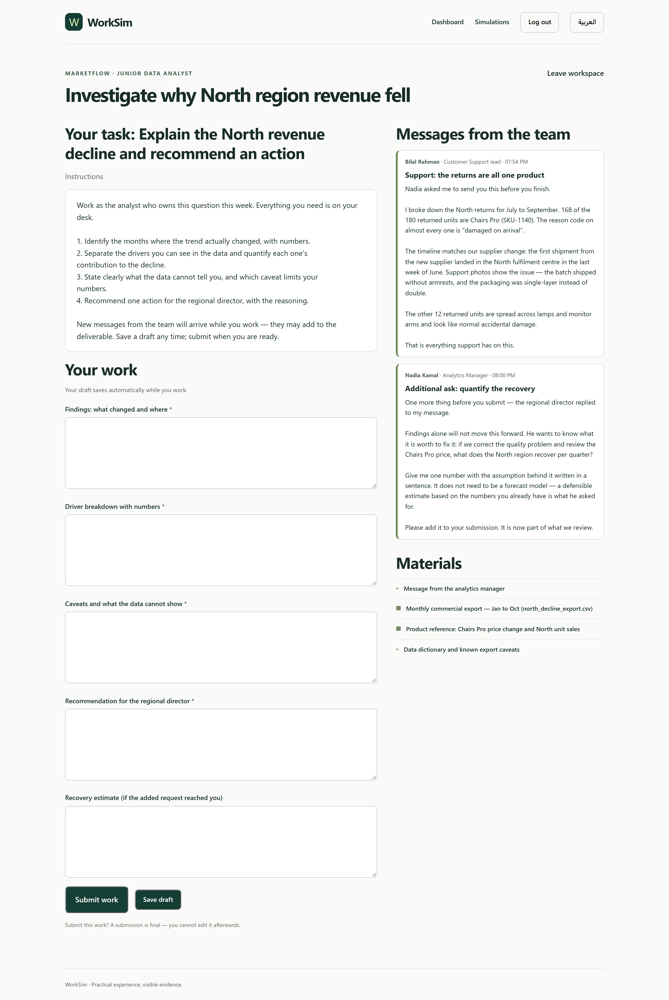
Learners use the MarketFlow workspace to inspect the sales dataset materials and complete the analysis fields.

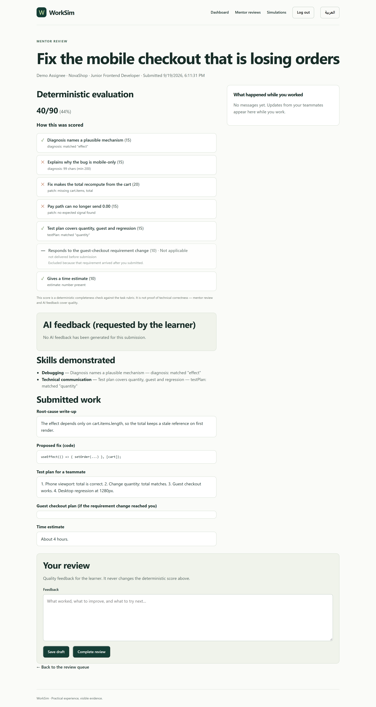
Mentors use the review screen to inspect submitted work with AI context and write human feedback.

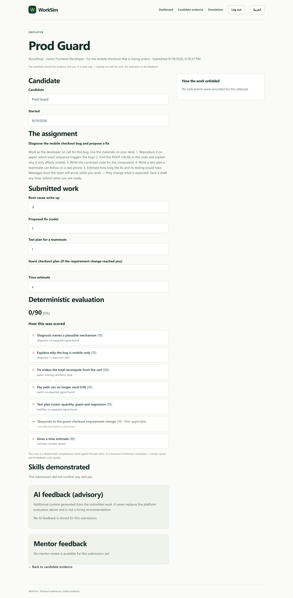
Employers use the evidence screen to inspect a consenting candidate's work, evaluation, skills and approach.

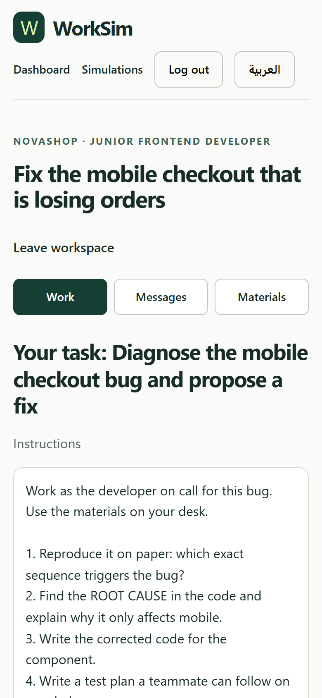
Learners use the workspace on a phone viewport (Work / Messages / Materials tab strip) with no horizontal overflow.

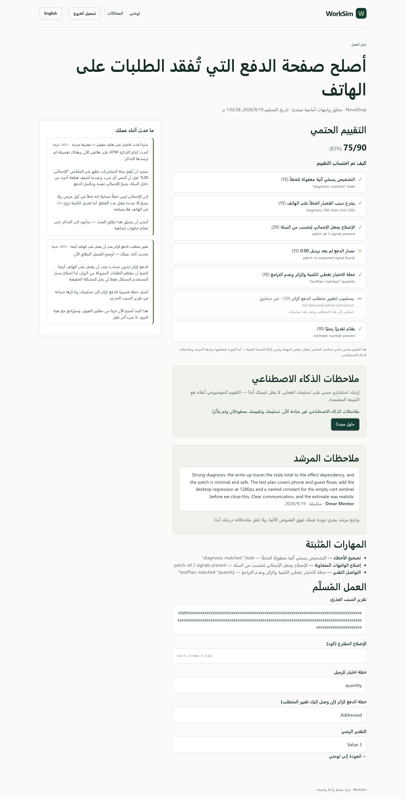
Arabic-speaking learners use the same core workflow in Arabic with correct RTL direction.

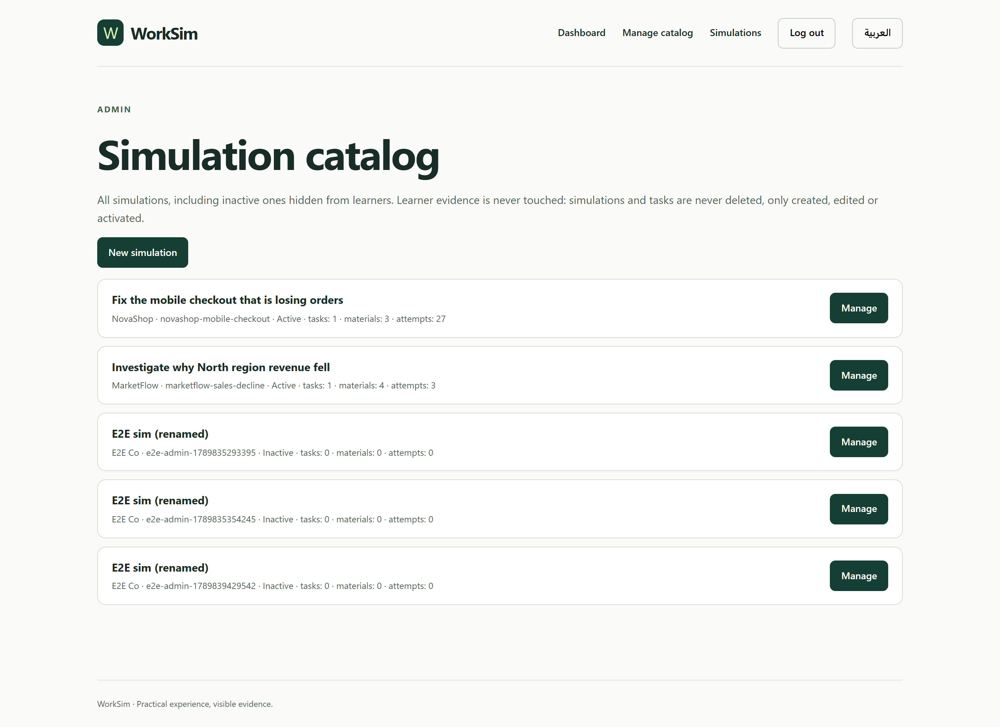
Admins use the catalog screen to create, edit and activate/deactivate simulations without touching learner evidence.

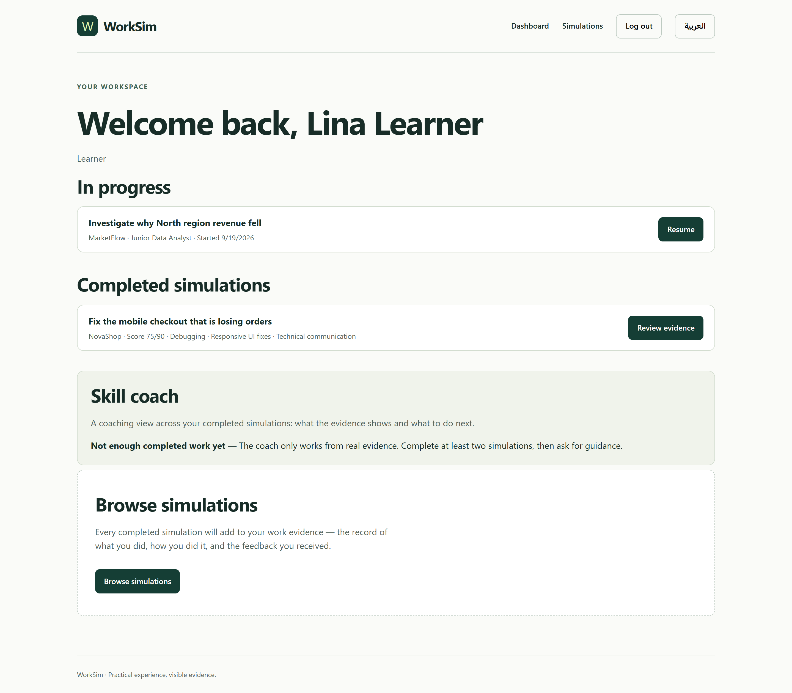
Learners use the dashboard coach section to get cross-simulation skill guidance once enough evidence exists.

Notes recorded during capture, not hidden:

- Shot 05's AI section reflects **stored** feedback for that submission. The
  seeded demo submission carries a cached review stamped `model: "seed:demo"`
  (see `docs/OUT-OF-SCOPE.md`); a submission with no stored review renders the
  neutral "not available" state and is captured as such rather than dressed up.
- Shot 10 is asserted to have `document.documentElement.dir === 'rtl'` in the
  session that produced it; an earlier bug in the capture script (writing the
  wrong `localStorage` key) produced a duplicate/wrong shot and is why that
  assertion exists.
- Shot 12 shows the coach section in its honest "not enough completed work yet"
  state for the seeded learner (the coach requires at least two completed
  simulations); the section, its explanation and its next-step guidance are the
  shipped feature, not a mockup.
- Screenshots are regenerated automatically; re-running the script overwrites
  these files, so they should be refreshed whenever the UI changes.

